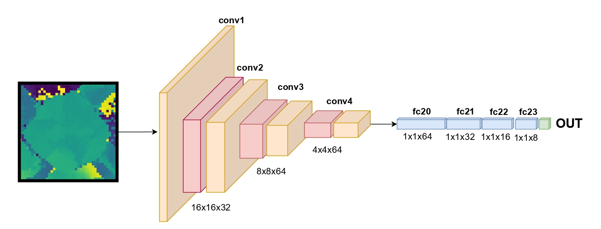
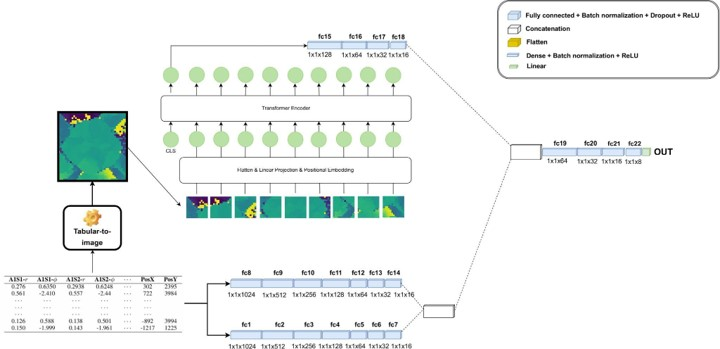

# [TINTOlib](https://tintolib.readthedocs.io/en/latest/): A Python Library for Tabular-to-Image Transformations in Vision-Based Machine Learning  
#### (Article in review)

[](https://github.com/oeg-upm/TINTOlib-Documentation/blob/main/LICENSE)
[](https://github.com/oeg-upm/TINTOlib-Documentation/blob/main/LICENSE)
[](https://pypi.python.org/pypi/)
[](https://tintolib.readthedocs.io/en/latest/)
[](https://colab.research.google.com/github/DCY1117/ECAI2024-Material/blob/main/Notebooks/Challenge/Tensorflow_Regression_CNN.ipynb)
[](https://colab.research.google.com/github/DCY1117/ECAI2024-Material/blob/main/Notebooks/Challenge/Tensorflow_Regression_CNN%2BMLP.ipynb)
[](https://colab.research.google.com/github/DCY1117/ECAI2024-Material/blob/main/Notebooks/Challenge/Tensorflow_Regression_ViT.ipynb)
[](https://colab.research.google.com/github/DCY1117/ECAI2024-Material/blob/main/Notebooks/Challenge/Tensorflow_Regression_ViT%2BMLP.ipynb)

<div align="center">
  
</div>

## Overview

**TINTOlib** is the first Python library specifically designed to transform tabular data into synthetic images, addressing a critical gap in the integration of tabular and image-based machine learning approaches. It supports a comprehensive set of transformation techniques optimized for state-of-the-art computer vision models, including Convolutional Neural Networks (CNNs) and Vision Transformers (ViTs). 

This library was introduced and validated in a scientific study, demonstrating significant improvements in regression and classification tasks. By enabling seamless integration of features extracted from synthetic images with numerical data using hybrid architectures, **TINTOlib** bridges the gap between tabular data processing and vision-based deep learning.

### Highlights
- **Transformation Techniques**: Provides cutting-edge tabular-to-image conversion methods like IGTD, SuperTML, and REFINED.
- **Architectural Support**: Designed for standalone vision models (e.g., CNNs, ViTs) and hybrid architectures combining these models with Multi-Layer Perceptrons (MLPs).
- **Platform Compatibility**: Works across **Linux**, **Windows**, and **macOS** with support for Python 3.7 and above.
- **Input Formats**: Compatible with **Pandas DataFrame** and **Tidy CSV Files**, where numerical features and target variables follow the Tidy Data standard.

### Architectures Explored

Below are examples of the architectures that can be built using TINTOlib and applied in your experiments:

- **Synthetic Images with CNN**  
  

- **Hybrid Neural Network with ViT (HyViT)**  
  

## Repository Structure

The repository is organized into step-by-step examples for transforming tabular data into images and applying vision models:
  - **Classification task**: Notebooks for classification task. 
  - **Regression task**: Notebooks for regression task. 
  - **logs**: contains detailed results from regression and classification experiments, including metrics (e.g., RMSE, accuracy), model architectures (e.g., CNN, ViT, HyCNN, HyViT), and the performance of TINTOlib’s transformation methods.


## Tabular-to-Image Transformation Methods

All the methods presented can be called using the [TINTOlib](https://tintolib.readthedocs.io/en/latest/) library. The methods presented include:

|                              Model                               |    Class     | Features |                                                                Hyperparameters                                                                 |
|:----------------------------------------------------------------:|:------------:|:--------:|:----------------------------------------------------------------------------------------------------------------------------------------------:|
|            [TINTO](https://github.com/oeg-upm/TINTO)             |  `TINTO()`   |  `blur`  |                   `problem` `algorithm` `pixels` `submatrix` `blur` `amplification` `distance` `steps` `option` `random_seed` `times` `verbose`                   |
|             [IGTD](https://github.com/zhuyitan/igtd)             |   `IGTD()`   |          | `problem` `scale` `fea_dist_method` `image_dist_method` `max_step` `val_step` `error` `switch_t` `min_gain` `zoom` `random_seed` `verbose` |
|       [REFINED](https://github.com/omidbazgirTTU/REFINED)        | `REFINED()`  |          |                                                      `problem` `n_processors` `hcIterations` `zoom` `random_seed` `verbose`      |
|                           [BarGraph]()                           | `BarGraph()`  |          |                                                    `problem` `pixel_width` `gap`  `zoom` `verbose`                                                    |
|                        [DistanceMatrix]()                        | `DistanceMatrix()`  |          |                                                          `problem` `zoom`  `verbose`                                                          |
|                         [Combination]()                          | `Combination()`  |          |                                                             `problem` `zoom`  `verbose`                                                              |
| [SuperTML](https://github.com/GilesStrong/SuperTML_HiggsML_Test) | `SuperTML()` |          |                                             `problem` `columns` `font_size` `image_size` `verbose`                                             |
|                         [FeatureWrap]()                          | `FeatureWrap()`  |          |                                                             `problem` `size` `bins` `zoom` `verbose`                                                              |
|                         [BIE]()                          | `BIE()`  |          |                                                             `problem` `precision` `zoom` `verbose`                                                              |

## More information

- For more detailed information, refer to the **[TINTOlib ReadTheDocs](https://tintolib.readthedocs.io/en/latest/)**.  
- GitHub repository: **[TINTOlib Documentation](https://github.com/oeg-upm/TINTOlib-Documentation)**.
- PyPI: **[PyPI](https://pypi.org/project/TINTOlib/)**.
- Moreover, we have a **[TINTOlib Crash Course](https://github.com/oeg-upm/TINTOlib-Crash_Course)**.

<!--

## Citation

If you use TINTO in your work, please cite the following:

- **[TINTO: Converting Tidy Data into Images](https://doi.org/10.1016/j.softx.2023.101391)**:
```bib
@article{softwarex_TINTO,
    title = {TINTO: Converting Tidy Data into Image for Classification with 2-Dimensional Convolutional Neural Networks},
    journal = {SoftwareX},
    author = {Manuel Castillo-Cara et al.},
    volume = {22},
    pages = {101391},
    year = {2023},
    doi = {https://doi.org/10.1016/j.softx.2023.101391}
}

And use-case developed in **[INFFUS Paper](https://doi.org/10.1016/j.inffus.2022.10.011)** 

```bib
@article{inffus_TINTO,
    title = {A novel deep learning approach using blurring image techniques for Bluetooth-based indoor localisation},
    journal = {Information Fusion},
    author = {Reewos Talla-Chumpitaz and Manuel Castillo-Cara and Luis Orozco-Barbosa and Raúl García-Castro},
    volume = {91},
    pages = {173-186},
    year = {2023},
    issn = {1566-2535},
    doi = {https://doi.org/10.1016/j.inffus.2022.10.011}
}
```
-->

## License

TINTOlib is available under the **[Apache License 2.0](https://github.com/oeg-upm/TINTOlib-Documentation/blob/main/LICENSE)**.

## Authors
- **[Manuel Castillo-Cara](https://github.com/manwestc) - [manuelcastillo@dia.uned.es](manuelcastillo@dia.uned.es)**
- **[Raúl García-Castro](https://github.com/rgcmme) - [r.garcia@upm.es](r.garcia@upm.es)**
- **[Jiayun Liu](https://github.com/DCY1117) - [jiayun.liu@upm.es](jiayun.liu@upm.es)**
- **[David González Fernández](https://github.com/DavidGonzalezFernandez)**


## Contributors

<div>
<p align = "center">
<kbd></kbd> <kbd></kbd> <kbd></kbd> 
</p>
</div>
